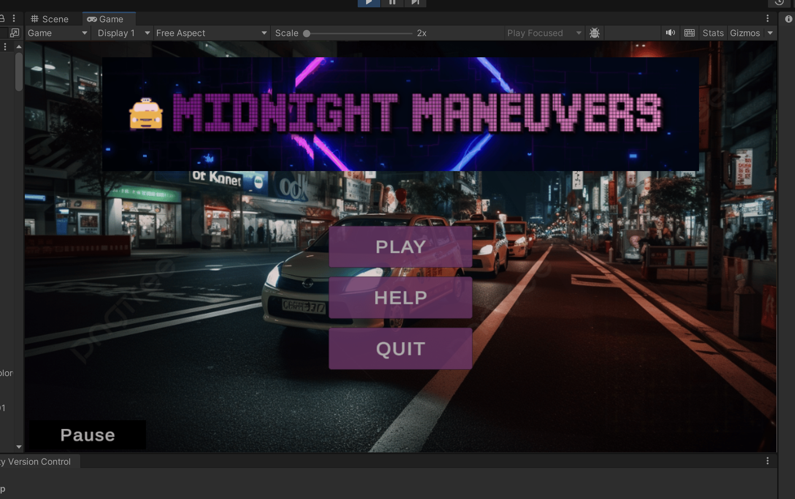
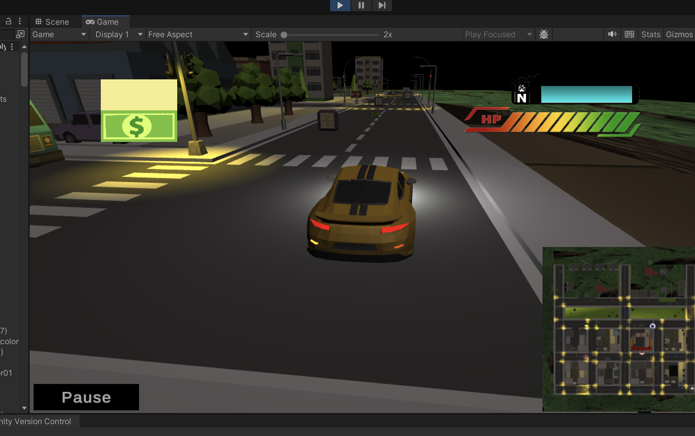
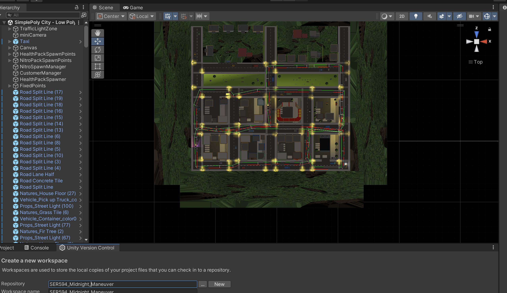

# Midnight Maneuvers



**Fasten your seatbelts – and avoid handcuffs!**

---

## Overview

**Midnight Maneuvers** is a high-octane game that combines classic arcade thrills with modern 3D action, designed to challenge players’ strategic thinking and quick reflexes. This innovative project demonstrates expertise in game design, player mechanics, and immersive environments, highlighting a blend of technical and creative skills essential for interactive software development.

Will you play it safe and follow the rules, or throw caution to the wind for bigger payouts? Every decision has consequences – are you ready to take the wheel?

---

## Key Features



- **Strategic Gameplay**: Pick up and drop off passengers while navigating a complex urban environment.
- **Point Collection System**: Earn tips and use them to upgrade your vehicle or buy nitro boosts for an edge.
- **Balanced Risk and Reward**: Follow traffic laws or take risks for higher payouts while evading police.
- **Classic Arcade Elements**: Power-ups and score boosts enhance replayability and engagement.
- **Advanced AI**: Dodge persistent police patrols in dynamic, heart-pounding chases.

---

## Key Skills Demonstrated

- **Game Development**: Comprehensive use of Unity Engine to create realistic 3D environments and player mechanics.
- **Programming Expertise**: Developed systems for vehicle physics, nitro boosts, power-ups, and AI-driven police evasion using C#.
- **Systems Design**: Designed a point-based progression system and dynamic level challenges to maintain player engagement.
- **Creative Direction**: Combined film noir aesthetics with modern gameplay for an immersive user experience.
- **Team Collaboration**: Worked collaboratively on a multidisciplinary team to ensure consistent vision and execution.

---

## Gameplay



Players navigate a neon-lit cityscape as a nighttime cabbie, balancing efficiency, risk, and resource management. The gameplay emphasizes:

1. **Traffic Compliance**: Follow laws to avoid drawing attention.
2. **Route Optimization**: Plan the fastest and safest paths.
3. **High-Stakes Decisions**: Weigh shortcuts against potential risks.
4. **Dynamic Challenges**: Avoid cop patrols while collecting power-ups and earning tips.
5. **Upgrades**: Enhance vehicle capabilities to improve performance and survivability.

---

## Project Highlights

### Setting:
- A realistic, bustling city with neon lights and a film noir aesthetic.
- Dynamic audio design featuring police sirens, urban sounds, and immersive effects.

### Technical Achievements:
- Implemented an AI-driven police pursuit system inspired by popular games.
- Designed player mechanics including nitro boosts, vehicle physics, and environmental interactions.
- Integrated power-up systems and reward mechanics for progression.
- Optimized performance for seamless gameplay across devices.

## Installation

### Prerequisites
- Unity Engine (version X.X.X or higher)
- A device capable of running 3D games

### Steps
1. Clone this repository:
   ```bash
   git clone https://github.com/your-username/midnight-maneuvers.git
   ```
2. Open the project in Unity.
3. Build and run the game on your preferred platform.

## Acknowledgements

This project was part of a group project in course for **SER 594: Game Programming and Design** at **Arizona State University**.

---

Showcasing the intersection of creativity and technical expertise, **Midnight Maneuvers** is a testament to innovation in interactive software development and game design.


